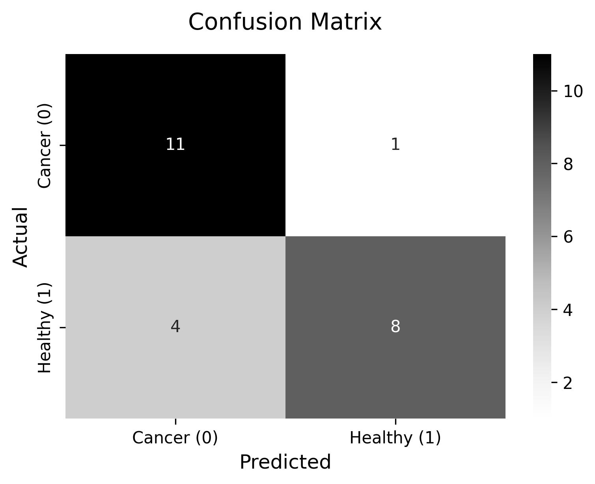

# BreastCancerSense

A machine learning tool for early breast cancer detection using clinical data.

## Purpose
BreastCancerSense predicts breast cancer using clinical data to aid early detection.

## Overview
- Predicts breast cancer using the [Breast Cancer Coimbra Dataset](https://archive.ics.uci.edu/dataset/451/breast+cancer+coimbra) (116 samples, 9 features: Age, BMI, Glucose, etc.).
- Uses XGBoost with GridSearchCV for training (accuracy: ~85%, see `output/output.txt`).
- Features a Streamlit app for user predictions and visualizations (e.g., confusion matrix).

## Screenshot
  
*Sample confusion matrix from the model.*

## Requirements
- Python 3
- Libraries: `pandas`, `numpy`, `scikit-learn`, `xgboost`, `matplotlib`, `streamlit`

## How to Run
1. Navigate to the `code` directory:  cd "Breast Cancer Coimbra/code"
2. Train the model:  python3 train_model.py
3. Run the app:   streamlit run predict_ui.py

## Directory Structure
- `data/dataR2.csv`: Dataset.
- `code/train_model.py`: Trains the model.
- `code/predict_ui.py`: Streamlit app.
- `output/`:
- `breast_cancer_model.pkl`: Trained model.
- `scaler.pkl`: Scaler for data.
- `prediction_counts.jpeg`: Confusion matrix plot.
- `output.txt`: Model metrics.

## Author
Diksha Gupta, 2025 Major Project MCA final year

